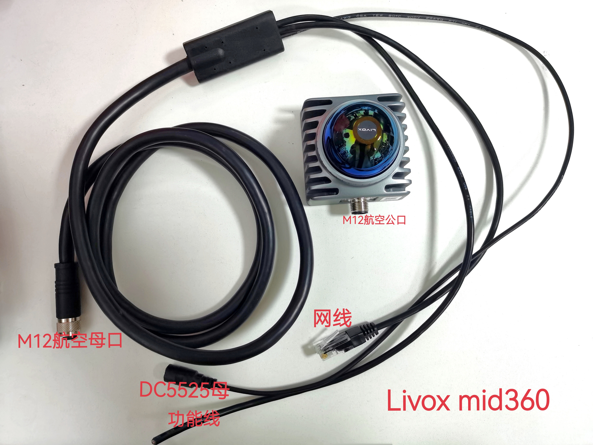
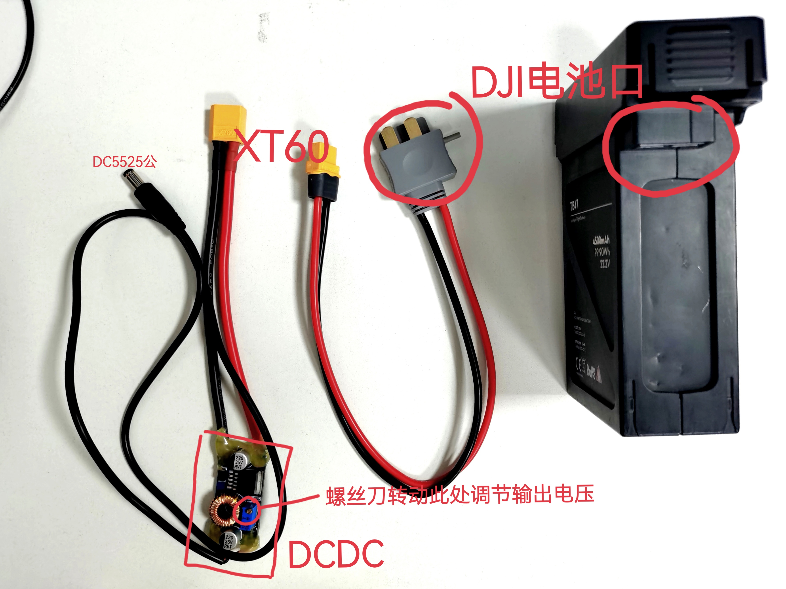
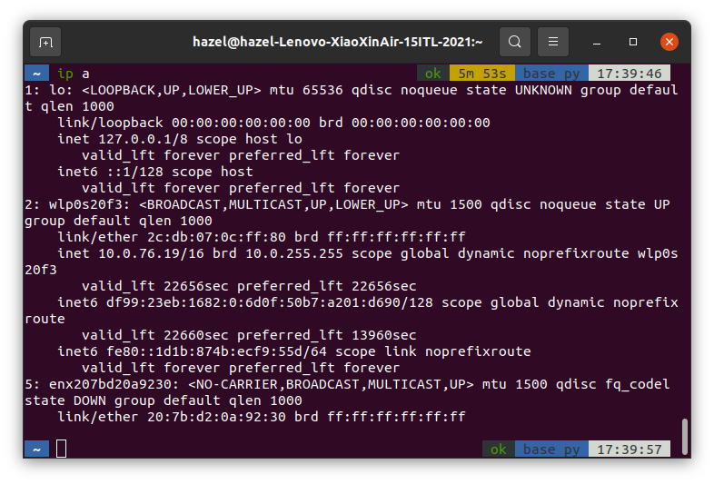
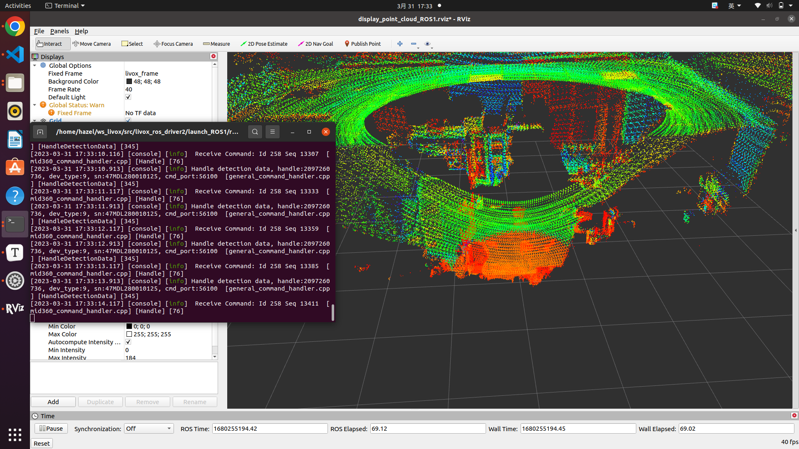

# For Livox Mid-360

--by Hazel@FuRoC-Tsinghua


This doc records the steps and potential problems in using **Livox Mid-360** under **Ubuntu 20.04 + ROS noetic**.

## Step 0 (Hardware): Power up Livox



Note **the direction** of M12 cable's connection !!!


Livox can accept input from 9V to 27V with an recommended input of 12V

-- In test 9V input is not sufficient to properly power up Livox.

Powering Livox with:

1. DC5525 - XT30 - Tinker 12V distributor board 
2. DC5525 - XT60 - DCDC 19V to 12V - DJI battery (22.2V out)

-- Livox will slightly vibrate when working

DC5525: inner circle = power+; outer circle = power-

Check the distributor board in 1 or DCDC in 2 if not successfully booted.




## Step 1: Driver Installation

1. Install Livox SDK2 following: https://github.com/Livox-SDK/Livox-SDK2

2. Install Livox ROS driver2 following: https://github.com/Livox-SDK/livox_ros_driver2

* Note that there are several "ROS drivers" for Livox. Here we use ROS driver2 which supports Livox Mid-360 with ROS1.


**Prerequisites when building:**

`pip install empy`

`pip install catkin_pkg`


**Possible problem:**

`python3-empy` already installed but got error message when building:

```bash
CMake Error at /opt/ros/noetic/share/catkin/cmake/empy.cmake:30 (message):
  Unable to find either executable 'empy' or Python module 'em'...  try
  installing the package 'python3-empy'
```
Reason: Default compilation is not done with a proper python3
Solution: `[original command] -DPYTHON_EXECUTABLE=/usr/bin/python3`


## Step 2: Wired Connection

#### First-time Connection

When connecting Livox for the first time, you will have to set

1. Connect Livox network cable to your PC with external power input of 12V

2. Set your PC to static IP following this:

   Use `ip a` to check the name of your network card

   Output will be like this:

   

   Here the network card with the name "enx207bd20a9230" is the one to modify. In your PC it might have the name "enxxxxxxxxx".

   

   Then use `ls /etc/netplan` to check the existing netplans. You might see files with name "01-xxxxxx.yaml". Check if the network card name is the one to modify, otherwise create a new file with any name you like. Make sure you save a copy of the original configuration file if you are making modification on an existed one. 

   Add the following lines to the yaml file created or merge it with the original file. Remember to replace the network card name with a proper one.
   
   ```yaml
   network:
     version: 2
     renderer: networkd
     ethernets:
       enx207bd20a9230:
         dhcp4: false
         addresses: [192.168.1.5/24]
         gateway4: 192.168.1.1
         nameservers:
           addresses: [8.8.8.8, 1.1.1.1]
   ```

   **Note that** in Livox MID-360 handbook, it claims you should set the IP address of your PC as `192.168.1.50` , but in fact the `host_ip_name` in `config/MID360_config.json` is `192.168.1.5` !

   And the `/24` means you are using `255.255.255.0` as your netmask.
   
   Then use  `sudo netplan try` to test the  configuration file and then`sudo netplan apply` to apply.
   
   

#### Connecting Livox to Tinker

- Connect PC and Livox to the router.
- Wait until a "Hotspot Login" page pop-up on the PC
- Check Livox ip


## Step 3: Launching Livox

 Before launching, two parameters in the ROS driver have to be modified:

1. `bd_list` in `launch_ROS1/*_MID360.launch` file: scan the QR code on Livox to get the code, this parameter can be received from terminal input with, for example: `bd_list:="47MDL280010125"`
2. `ip` in `config/MID360_config.json`: the default ip is `192.168.1.1xx`, `xx` are the last two digits in `bd_list`


Then you can launch your Livox with the following command (change the `bd_list` param into correct digits:

```bash
source ~/ws_livox/devel/setup.zsh
```

```bash
roslaunch livox_ros_driver2 rviz_MID360.launch bd_list:="47MDL280010125"
```


